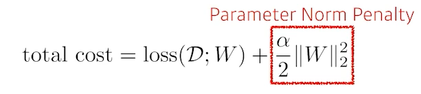

# Optimization

: 최적화에 대한 용어를 잘 이해하고 넘어가야함

Gradient Descent (경사하강법)

: loss function 최솟값을 찾기 위해 편미분법을 활용한 방법

: local minimum을 찾음

### Optomization 정리

Generalization (일반화)

: training error와 test error의 차이(gap)

underfitting vs overfitting

: 과소적합, 과적합

cross-validation

: train data, test data, validation data로 나누어서 학습과 평가를 진행하는 것

bias & variance

- bias: 평균적으로 가운데에 가까우면 bias가 낮음 -> 좋음
- variance: 밀집도가 높으면 variance가 낮음 -> 좋음

-> 이 둘은 tradeoff 관계를 가짐!

bootstrapping

: 학습데이터를 sub sampling을 만든 후 matric을 만들어서 최적값을 찾는 기법

bagging vs bootstraping

- bagging (Bootstrapping aggregating)

  : 여러 모델을 만든 후 각각의 모델을 독립적으로 bootstrapping

- boosting

  : ex. 간단한 모델을 하나 만듦 -> 100개중 80개는 잘 설명하는데 20개는 설명을 못함 -> 20개에 대한 설명을 할 수 있는 2번째 모델 생성

### Practical Gradient Descent Methods

- stochastic gradient descent

  : 한개의 샘플로 계산

- Mini-batch gradient descent

  : 128개, 256개와 같은 batch 단위로 gradient 계산 (대부분 사용)

- Batch gradient descent

  : 한번에 전부 다 써서 계산

#### Batch-size Matters

: 하나씩 하면 너무 시간이 많이 걸리고 한번에 다하면 정확도가 떨어지니까 그 중간을 정하는 문제!

#### gradient descent

n: Learning rage (학습률) -> 이거 적절히 잡는 게 진짜 어려움

gt: gradient 

#### Momentum

: 학습률을 횟수마다 적절히 변경시키기 위한 방법론

B: momentum

#### Nesterov Accelerated Gradient (NAG)

: local minimum을 좀더 빠르게 찾는 방법

#### Adagrad

: 그 동안의 변한 파라미터를 반영 -> 그러나 점점 학습률이 낮아지는 단점이 있음

#### Adadelta

: exponential moving average 활용하여 학습률이 낮아지는 단점을 보완 -> 그러나 실제로 활용이 많이 되진 않음

#### RMSprop

: Adagrad + exponential moving average + stepsize -> 잘됨

#### Adam

: 요즘 많이 씀

: momentum + EMA of gradient squares

# Regularization

: 학습에 규제를 검 -> 학습데이터 뿐만 아니라 테스트데이터에도 잘 작동하게 하기위해 규제를 거는 것 (generalization 참고)

Early Stopping

: validation data를 근거로 학습을 멈추는 것

Parameter Norm Penalty

: neural network parameter가 너무 커지지 않게 하는 것

Data Augmentation

: DL에서 data가 많을수록 잘됨

: 주어진 데이터를 지지고 볶아서 데이터셋을 늘리는 것 -> 데이터가 크게 손상되지 않는 선(label이 변경되지 않는 선)에서 데이터 조작을 가하는 것

Noise Robustness

: 입력데이터에 노이즈를 집어넣는 것(weight에도 집어넣기도 함)

Label Smoothing

: train 단계 데이터 2개를 뽑아서 섞어주는 것

- ResNet-50
- Mixup
- Cutout
- CutMix

Dropout

: 랜덤하게 몇개의 뉴런을 0으로 바꿔주는 것

Batch Normalization

: layer 값들을 정규화시켜주는 기법

: 근데 논란이 많음 -> 근데 일반적으로 성능이 올라감..?

