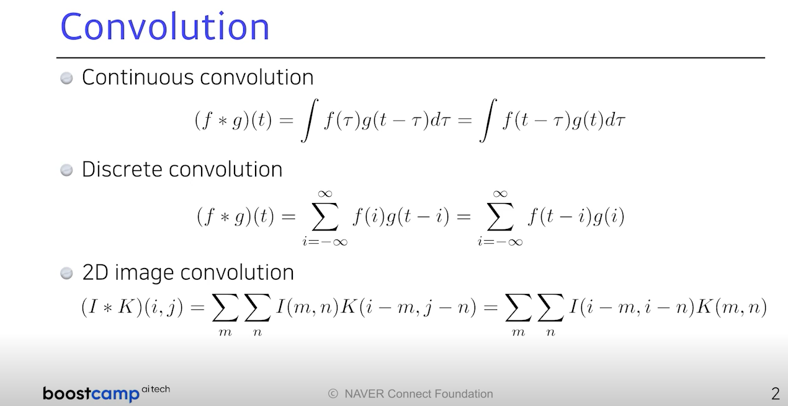

# CNN

### Convolution (합성곱)

: f 함수와 g 함수를 잘 결합하는 것 -> 이떄 g 함수는 filters

### convolition 계산, stack of convolutions

: 교재 잘 보고 계산할 줄 알기!

: 이거는 기억 안나면 강의 다시 보자 -> 근데 생각보다 이해는 쉬움, filter 적용만 조심해서 이해하기!

### Convolutional Neural Networks

- convolution layer

  : 도장을 찍어내는 층

- pooling layer

  : 2 by 2 pooling과 같이 convolution과 함꼐 정보를 추출하는 layer

- fully connected layer

  : decision making layer

-> 각 층에서의 parameter의 개수와 deep한 정도의 감을 항상 가지고 있는 것이 좋다. 

### Convolution Arithmetic

: parameter 계산

## 계산 방법은 잘 알아두기! 교재 확인!!

: 교재는 3짜리 필터를 활용한 예시

### Stride

: convolution filter(=kernel)을 찍는 간격

### padding

: padding을 적용하면 가장자리 convolution 가능

### parameter

: 계산 과정 교재 참고(p17)

dense layer로 갈수록 parameters가 기하급수적으로 늘어남

### 1 by 1 convolution

: Dimension reduction

: To reduce the number of parameters

