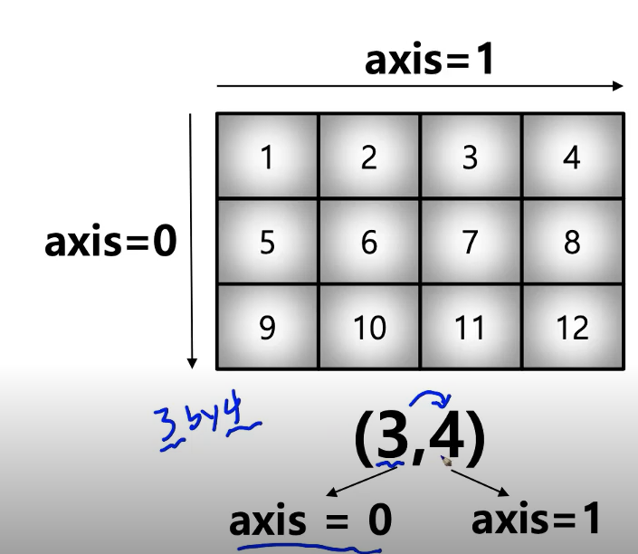

# numpy

: 행렬과 매트릭스 코드 표현

: numerical python


#### 특징

- list에 비해 빠르고 메모리 효율적
- 반복문 없이 데이터 배열에 대한 처리를 지원함
- 선형대수와 관련된 다양한 기능 제공
- C, C++ 등의 언어와 통합 가능


### ndarrary

: 배열 생성, 리스트랑 거의 같음

: ndarray 객체

: 메모리 활용이 효율적임

```python
test_array = np.array([1, 4, 5, 8], float) # 한가지 타입만 통일시켜서 넣어야함 (list와 가장 큰 차이)
test_array.shape # dimension 구성, 교재 참고하기
test_array.dtype # 데이터 type 반환
test_array.ndim # number of dimensions
test_array.size # data 개수
test_array.nbytes # 메모리 크기 반환 -> 방법 알아두기
# data type!
```


메모리

- 메모리의 크기가 일정
- is 연산(메모리의 위치 비교)도 list와 차이가 있음 (list는 같은 수치이면 같은 메모리에 들어가나 ndarray는 그렇지 않음)


### Handling shape


#### reshape

: Array의 shape의 크기를 변경함, element의 갯수는 동일

(활용 교재 코드 참고)


#### flatten

: 다차원 array를 1차원 array로 변환 (reshape 1차원 변환 버전)


#### indexing & slicing

indexing: list와 달리 \[0][0]이 아닌 [0, 0] 이런 식으로 표기해도 됨

slicing: 행과 열 부분을 나눠서 slicing이 가능함

(교재 코드 참고)


#### arange

: array의 범위를 지정하여 값의 list를 생성하는 명령어

: step에 floating point도 사용 가능


#### ones, zeros, empty

zeros

: 0으로 가득찬 ndarray 생성

```python
np.zeros(shape=(10,), dtype=np.int8)
```


ones 

: 1로 가득찬 ndarray 생성


empty

: shape만 주어지고 비어있는 ndarray 생성 (메모리 초기화가 안됨)


something_like

: 기존 ndarray의 shape 크기만큼 1, 0 또는 empty array를  반환


### identity

: 단위행렬을 생성함

```python
np.identity(n=3, dtype=np.int8)
```


#### eye

: 대각선이 1인 행렬 생성


#### diag

: 대각 행렬의 값을 추출함


### random sampling

: 데이터 분포에 따른 sampling으로 array 생성

(활용 교재 확인) uniform 분포랑 exponential 분포를 많이 사용함


### Operation function


#### sum

: ndarray element 간의 합을 구함, list의 sum 기능과 동일

var, std 이런 것들도 사용가능


### axis

: 모든 operation function을 실행할 때 기준이 되는 dimension 축



```python
test_array.mean(axis=1)
```


### concatenate

: numpy array를 합치는(붙이는 함수)

```python
a = np.array([1, 2, 3])
b = np.array([4, 5, 6])
np.concatenate((a, b), axis=0)
```

(교재로 붙이는 예시 확인하기)


#### newaxis

: 새로운 축을 추가해줄 때 쓰는 메서드


## array operations

: numpy는 array간의 기본적인 사칙 연산을 지원함

: array간 shape이 같을 때 일어나는 연산

: *의 경우 성분곱 연산


### Dot product

```python
test_a.dot(test_b)
```


### transpose

```python
test_a.transpose()
```


## broadcasting

: shape이 다른 배열 간 연산을 지원하는 기능

: array - scala 연산

: 교재 확인하기


### 연산 시간

: 교재 확인하기


## Comparisons

: and, or

: any, all

: 각각의 element에 대한 boolean에 대한 결과

```python
np.any(test<10)
```

: logical_something


### where

: 만족하는 조건의 index값을 반환

```python
np.where(test<3, 3, 2) #(condition, True, False)
```


## sort

argsort

: sorting한 "index"값을 반환


## Boolean index

: 특정 조건을 boolean으로 뽑아내는 것


## fancy index

: index value를 사용해서 값 추출

: take 메소드와 동일

: 이거는 교재 참고


## numpy I/O

: 교재 및 코드 확인